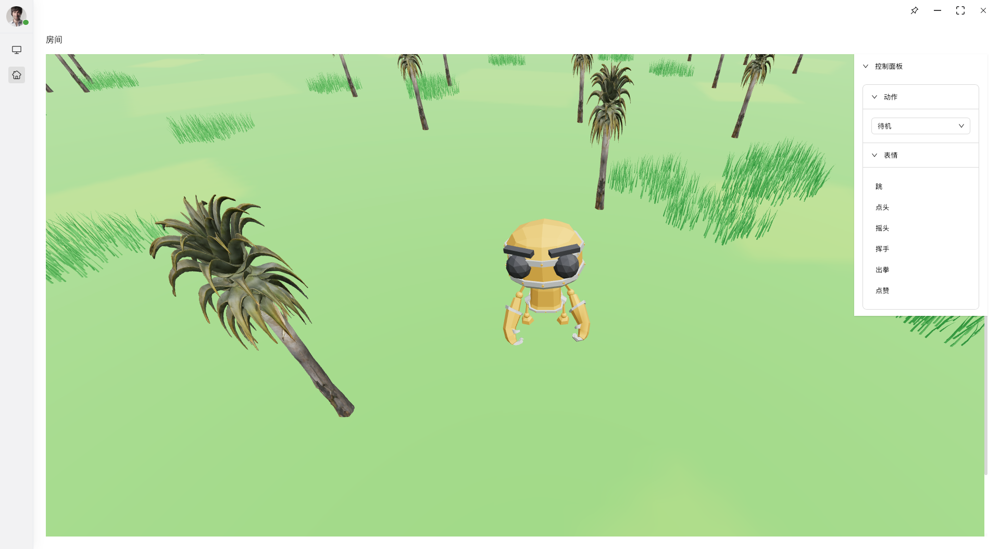
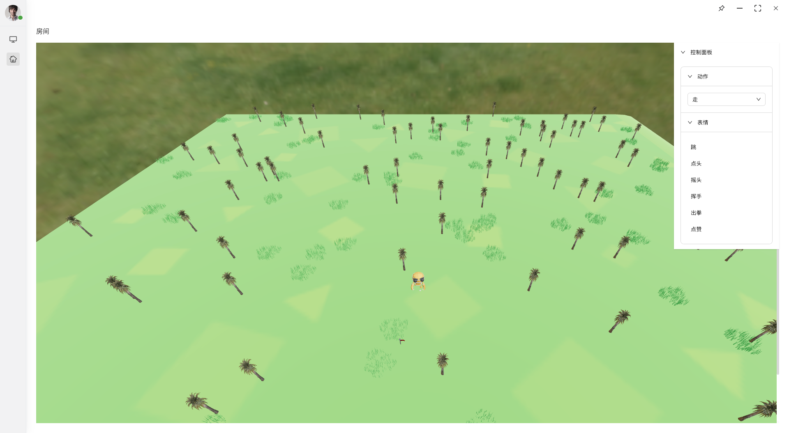
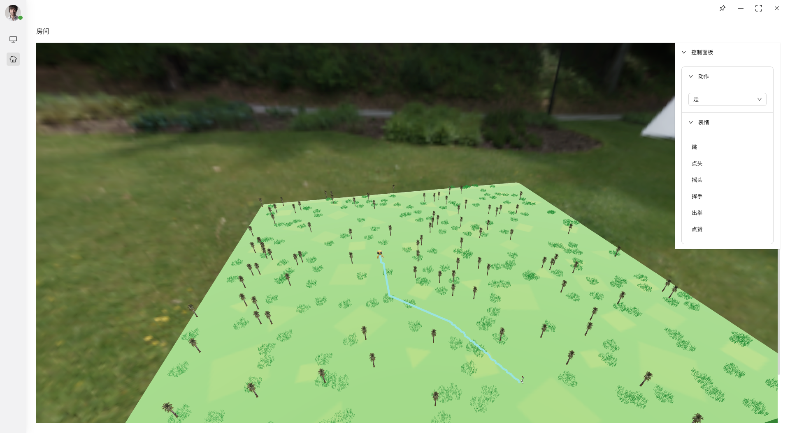

# n-3d
  `n-3d` 桌面壳子以及后端服务调用。
  
- [文档](https://beta.tauri.app/guides/)
- [Web端](https://github.com/poohlaha/n-3d-web)

## 使用
下载 `Web 端` 和 `后端` 放于同一目录下, 然后运行如下命令

```shell
make webInstall
```

## 运行及构建
```shell
make run # 运行
make build # 打包
```

## 升级 Rust 版本
   升级 `Rust` 版本, 确认在 `1.85+`
```shell
rustup update stable
cargo --version
rustc --version
```

## 效果


